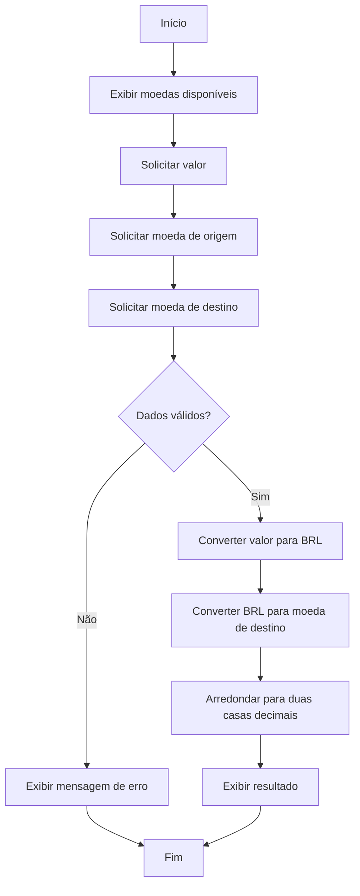

# Documentação Técnica — Conversor de Moedas

## 1. Descrição da funcionalidade

O Conversor de Moedas é uma aplicação simples desenvolvida em Python que permite realizar conversões entre três moedas: Real brasileiro (BRL), Dólar americano (USD) e Euro (EUR).

O usuário informa um valor numérico, a moeda de origem e a moeda de destino. A aplicação valida os dados fornecidos e, caso sejam válidos, realiza a conversão utilizando taxas previamente definidas no código.

O resultado da conversão é apresentado com duas casas decimais.

O projeto possui finalidade didática e foi desenvolvido para aplicar conceitos de desenvolvimento de software, documentação, metodologia ágil e testes unitários.

---

## 2. Requisitos e critérios de aceitação

A aplicação foi desenvolvida considerando os seguintes critérios:

- Permitir conversões entre BRL, USD e EUR;
- Permitir que o usuário informe o valor que deseja converter;
- Permitir a escolha da moeda de origem e da moeda de destino;
- Calcular corretamente o valor convertido;
- Apresentar o resultado com duas casas decimais;
- Arredondar corretamente os resultados;
- Permitir a conversão de uma moeda para ela mesma;
- Não aceitar valores negativos;
- Não aceitar moedas que não sejam suportadas pelo sistema;
- Apresentar mensagens de erro para entradas inválidas.

---

## 3. Tecnologias utilizadas

O projeto utiliza as seguintes tecnologias:

- Python;
- Framework `unittest`, pertencente à biblioteca padrão do Python;
- Visual Studio Code para desenvolvimento;
- Trello para organização das atividades da sprint;
- Git e GitHub para versionamento e armazenamento do projeto.

---

## 4. Moedas e taxas de conversão

A aplicação utiliza taxas de conversão pré-definidas em relação ao Real brasileiro (BRL).

| Moeda | Taxa em BRL |
|---|---:|
| BRL | 1,00 |
| USD | 5,00 |
| EUR | 6,00 |

Dessa forma, para fins desta aplicação:

- 1 BRL = 1,00 BRL;
- 1 USD = 5,00 BRL;
- 1 EUR = 6,00 BRL.

Esses valores são fixos e utilizados exclusivamente para fins didáticos. Portanto, não representam necessariamente as cotações atuais das moedas.

---

## 5. Funcionamento da conversão

A função principal responsável pela lógica da aplicação é `converter_moeda()`.

Ela recebe três informações:

- valor a ser convertido;
- moeda de origem;
- moeda de destino.

Inicialmente, os códigos das moedas são convertidos para letras maiúsculas. Dessa forma, entradas como `usd`, `Usd` e `USD` podem ser interpretadas da mesma maneira.

Em seguida, o sistema verifica se o valor é válido e se as moedas informadas são suportadas.

Para realizar a conversão, o valor informado é primeiro convertido para BRL. Depois, o valor em BRL é convertido para a moeda de destino.

Por exemplo, considerando a conversão de 10 USD para EUR:

1. 10 USD × 5,00 = 50,00 BRL;
2. 50,00 BRL ÷ 6,00 = 8,33 EUR.

Portanto, o resultado apresentado é:

`10,00 USD = 8,33 EUR`

O resultado final é arredondado para duas casas decimais.

---

## 6. Diagrama de fluxo

O fluxo principal da aplicação pode ser representado pelo seguinte diagrama:



---

## 7. Interface

A aplicação utiliza uma interface de linha de comando (CLI — Command-Line Interface).

A interação ocorre por meio do terminal. A função `input()` é utilizada para receber informações do usuário e a função `print()` é utilizada para apresentar mensagens e resultados.

Ao executar o programa, a interface apresenta:

```text
=== Conversor de Moedas ===
Moedas disponíveis: BRL, USD e EUR
Digite o valor que deseja converter:
Digite a moeda de origem:
Digite a moeda de destino:
```

Um exemplo de utilização é:

```text
Digite o valor que deseja converter: 30
Digite a moeda de origem: USD
Digite a moeda de destino: BRL

30.00 USD = 150.00 BRL
```

---

## 8. Validação e tratamento de erros

A aplicação possui validações para impedir algumas operações inválidas.

### Valor negativo

Valores negativos não são aceitos. Caso sejam informados, a aplicação gera um erro.

Exemplo:

```text
Erro: O valor não pode ser negativo.
```

### Moeda de origem inválida

Caso a moeda de origem não esteja entre BRL, USD e EUR, a operação não é realizada.

Exemplo:

```text
Erro: Moeda de origem inválida.
```

### Moeda de destino inválida

Da mesma maneira, moedas de destino não suportadas também são rejeitadas.

Exemplo:

```text
Erro: Moeda de destino inválida.
```

Essas validações evitam que o sistema realize cálculos utilizando informações que não estão definidas na aplicação.

---

## 9. Armazenamento de dados

A aplicação não utiliza banco de dados.

As taxas de conversão são armazenadas diretamente na memória durante a execução do programa, por meio de um dicionário Python.

A estrutura utilizada é:

```python
TAXAS_PARA_BRL = {
    "BRL": 1.00,
    "USD": 5.00,
    "EUR": 6.00
}
```

Como os dados são definidos diretamente no código-fonte, nenhuma informação é persistida após o encerramento da aplicação.

---

## 10. APIs e serviços externos

A versão atual do sistema não utiliza APIs ou serviços externos.

As taxas de conversão são pré-definidas no próprio código.

Essa decisão simplifica a aplicação e permite que os testes unitários produzam sempre resultados previsíveis, independentemente das variações das cotações reais.

Como melhoria futura, o sistema poderia utilizar uma API de câmbio para consultar taxas atualizadas.

---

## 11. Testes unitários

Os testes automatizados foram implementados utilizando o framework `unittest`, disponível na biblioteca padrão do Python.

Os testes verificam diferentes comportamentos da função de conversão, incluindo:

- conversão de USD para BRL;
- conversão de BRL para USD;
- conversão de EUR para BRL;
- conversão de USD para EUR;
- conversão entre moedas iguais;
- conversão do valor zero;
- rejeição de valores negativos;
- rejeição de moeda de origem inválida;
- rejeição de moeda de destino inválida;
- utilização dos códigos das moedas com letras minúsculas.

Foram implementados 10 testes unitários.

Durante a execução dos testes, todos foram concluídos com sucesso:

```text
Ran 10 tests in 0.001s

OK
```

O resultado `OK` indica que todos os comportamentos testados apresentaram os resultados esperados.

---

## 12. Execução da aplicação

Para executar o conversor, abra o terminal na pasta do projeto e utilize:

```bash
python conversor.py
```

O programa solicitará o valor, a moeda de origem e a moeda de destino.

---

## 13. Execução dos testes

Para executar os testes unitários, utilize:

```bash
python -m unittest test_conversor.py -v
```

A opção `-v` executa o `unittest` em modo detalhado, permitindo visualizar individualmente o resultado de cada teste.

---

## 14. Estrutura do projeto

A estrutura básica do projeto é:

```text
Parada Obrigatória 01 - Alta Qualidade em Software/
│
├── conversor.py
├── test_conversor.py
│
└── docs/
    └── documentacao_tecnica.md
```

O arquivo `conversor.py` contém a implementação da aplicação.

O arquivo `test_conversor.py` contém os testes unitários.

O diretório `docs` armazena a documentação técnica do projeto.

---

## 15. Possíveis melhorias futuras

A aplicação pode ser expandida futuramente com novas funcionalidades, como:

- integração com uma API para obtenção de cotações atualizadas;
- suporte a mais moedas;
- desenvolvimento de uma interface gráfica ou interface web;
- histórico das conversões realizadas;
- persistência de informações em banco de dados;
- ampliação da cobertura de testes;
- testes específicos para possíveis integrações com serviços externos.